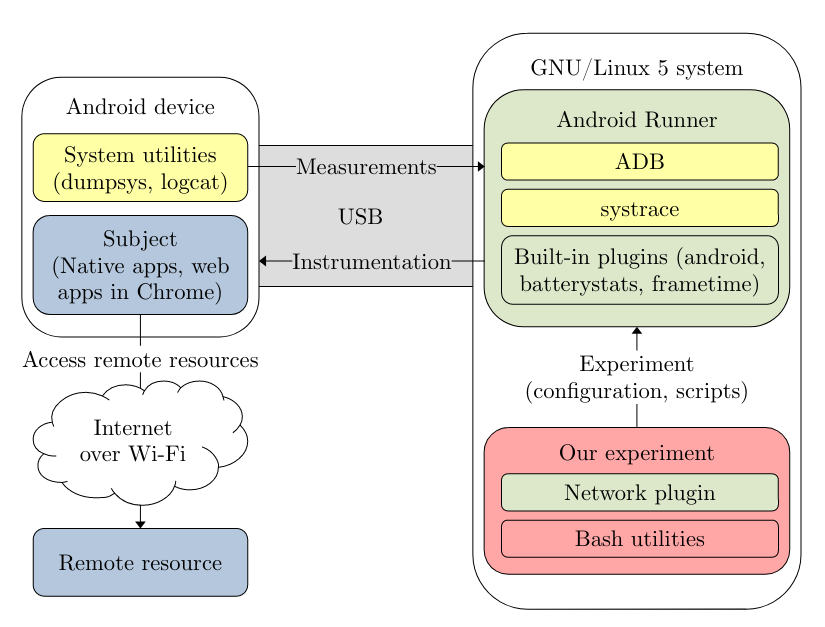

# MOBILESoft 2023 – Replication package
This repository contains the replication package and dataset of the paper for MOBILESoft 2023 with the title **Native vs Web Apps: Comparing the Energy Consumption and Performance of Android Apps and their Web Counterparts**.

## How to cite
If you use this replication package or parts of it, please cite the following paper:
```bibtex
@inproceedings{
    MOBILESoft_2023,
    title={{Native vs Web Apps: Comparing the Energy Consumption and Performance of Android Apps and their Web Counterparts}},
    booktitle={Proceedings of the 10th International Conference on Mobile Software Engineering and Systems 2023},
    author={Horn, Ruben and Lahnaoui, Abdellah and Reinoso, Edgardo and Peng, Sicheng and Isakov, Vadim and Islam, Tanjina and Malavolta, Ivano},
    venue={Melbourne, Australia},
    year={2023},
    month={May}
}
```

## Overview of the replication package
This replication package is a fork of [Android Runner](https://github.com/S2-group/android-runner) structured as follows:
```
/
.
|-- AndroidRunner/  From the Android Runner framework
|-- docs/           From the Android Runner framework
|-- documentation/  From the Android Runner framework
|-- examples/       From the Android Runner framework
|-- experiment/     The experiment itself
|-- MonkeyPlayer/   From the Android Runner framework
|-- tests/          From the Android Runner framework
```

### Overview of the experiment directory
The experiment directory contains the following files:
```
experiment/
.
|-- apks/                       The APKs of the apps used in the experiment (see apks/summary.txt)
|-- data-analysis/              The dataset andn R scripts for data analysis
|-- experiments/                The Android Runner experiment configuration files
|   |-- Scripts/                Python scripts used by Android Runner as hooks
|   |   |-- interactions        Shell scripts to perform the interactions with the apps
|   |-- config_native.json      The experiment configuration for the native apps
|   |-- config_test.json        Just a test configuration
|   |-- config_web.json         The experiment configuration for the web apps
|-- Figures/                    The figures used in the paper (generated by data-analysis/analyze.R)
|-- plugins/                    Custom plugins for Android Runner
|   |-- frametimes2/            Modified plugin to use with Chrome browser app
|   |-- network/                Measure the network traffic volume using netstat
|   |-- powerprofiles/          Power profiles for the devices used in the experiment
|   |-- utils/                  Several shell scripts used by the framework throughout the experiment
|-- raw_results.tar.gz          The raw output of the runs for this experiment generated by Android Runner
|-- README.md                   Step-by-step instructions to replicate the experiment   
```

### Data analysis
From the data generated by the experiment or provided in the archive `raw_results.tar.gz` the dataset is compiled using the script `experiment/utils/run_to_csv.py`.
This is then used to perform the data analysis using the following files:
```
data-analysis/              The dataset andn R scripts for data analysis
.
|-- analyze.R               Script to perform the data analysis
|-- experiment_results.csv  The dataset used by analyze.R generated by run_to_csv.py
|-- install_packages.R      Script to install the required R packages
```

### Dataset
The following files contain the data that is used in this paper:
```
- experiment/apks/summary.txt                       The native app packages and versions used in the experiment
- experiment/data-analysis/experiment_results.csv   The final dataset generated from the raw output of the
                                                    experiment generated by Android Runner
- experiment/utils/Candidate_subjects.csv           Web app domains with existing native app counterparts
                                                    from which subjects were selected
                                                    (generated by experiment/utils/select_candidate_subjects.py)
- experiment/raw_results.tar.gz                     The raw output for this experiment generated by Android Runner

```

## Replicating the experiment
The original readme of Android Runner can be found [here](./ANDROID-RUNNER.md).
Follow the setup instructions for Android Runner before you continue.
The experiment itself and specific instructions can be found under [`experiment`](./experiment/README.md).
To perform the replication, three main steps are required:
1. Install the prerequisites relating to Android Runner, app subjects and R
2. Run the experiment using Android Runner
3. Compile the dataset from the raw results and perform the data analysis

## Overview of the experiment setup
The figure below shows the components of the experiment setup.

